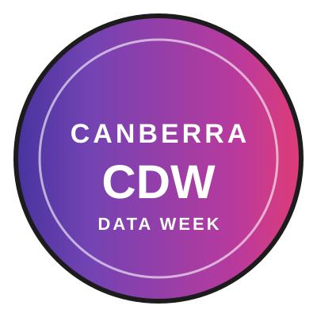
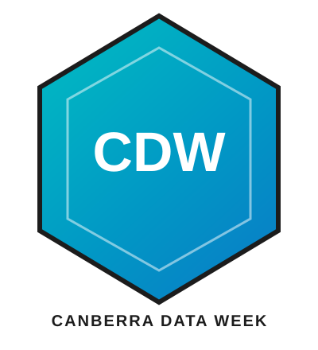
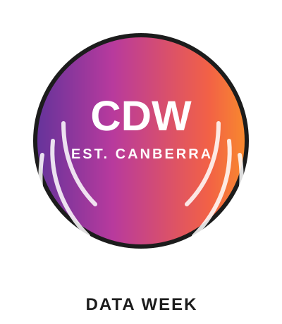

# Canberra Data Week (CDW)

## Crest Concepts

Five crest design concepts, inspired by the gradients and brand palette used in
`CDW Logo.svg.svg` and `CDW Banner.svg.svg`. Pick a favorite as a starting point
for the final CDW crest.

| Shield | Circular Badge | Data Node Shield |
| --- | --- | --- |
|  |  |  |

| Hexagon | Laurel Emblem |
| --- | --- |
|  |  |

See [assets/crests/README.md](assets/crests/README.md) for descriptions of each concept.
